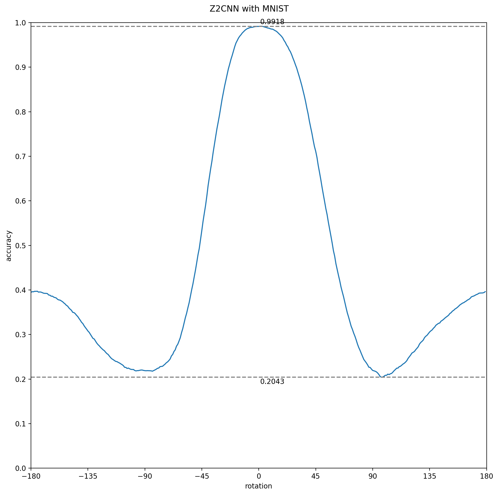

## cnn-pytorch-experiments

Taco Cohen's experiments are being reproduced in this repository with the aim of continuing this line of study and improving equivariance and invariance in artificial neural networks.

### Results

Here you can see the results of evaluating the different models with the test data set rotated from -180° to 180°.

| Model used           | Plot results                                                             | Details                                                                                                                                                 |
|----------------------|--------------------------------------------------------------------------|---------------------------------------------------------------------------------------------------------------------------------------------------------|
| Z2CNN                |       | The expected behavior is obtained since the layers of this model do not have equivariance, so it is normal that the maximum number of hits is around 0. |
| Z2CNN (ROT-MNIST)    |    | It behaves more stably at all angles while retaining peak hits. However, this is common since it has been trained with ROT-MNIST.                       |
| P4CNNP4              |     | It can be seen that the rotation invariance is not working properly since at angles far from 0º it has a very low hit rate.                             |
| P4CNNP4 (ROT-MNIST)  |  | It seems that there is not much difference with the Z2CNN model also trained with ROT-MNIST.                                                            |
| ConvEq2D             |                                    |                                                                                                                                                         |
| ConvEq2D (ROT-MNIST) |                                    |                                                                                                                                                         |

    
